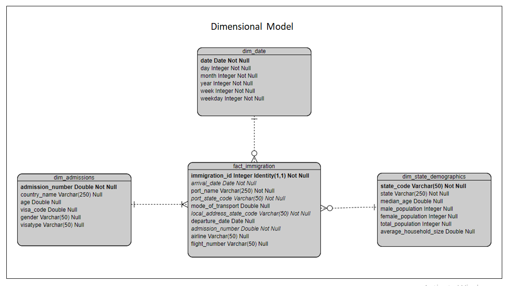
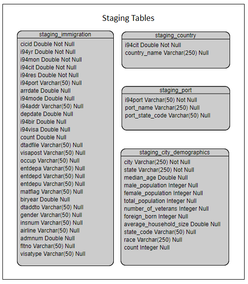

# Project Capstone: US Immigration Data Model
 
This project creates an ETL pipeline to load data from various sources and clean and process the data into dimensional tables. The dimensional tables can be used to answer questions related to port of entry states from which immigrants were entering the United States, as well as details about the immigrants themselves. e.g. What is the median age in the state where the most migrants enter with a B2 visa type?
 
## Introduction

The Udacity provided project has been used. This project creates an ETL pipeline that loads data from various sources into staging tables, then cleans and processes the data into a set of dimensional tables to be queried using Spark and Python (including Pyspark and Pandas). Input data - The immigration dataset from US I94 Immigration data and U.S. city demographic dataset from OpenSoft were used. Output data - Parquet files consisting of processed data in a Star Schema dimensional model.  

## Project Files

The project workspace includes the following files:

1. Capstone Project Template.ipynb - python notebook that provides a write-up of the entire project using a sample of 100000 records.
2. dl.cfg - config file that stores filepaths for data.
3. etl.py - reads data from the input filepaths, processes that data using Spark, and writes them back to the output filepath. 
4. README.md - This file provides discussion on the project.

## Data Sets

There are 4 datasets that need to be loaded and processed to be used for analysis:

1. **I94 Immigration Data**: From the US National Tourism and Trade Office.
    * Data consists of US immigration data for 2016 (Jan - Dec) - The January dataset will be used for this project
    * Location: data/18-83510-I94-Data-2016
    * Link: https://travel.trade.gov/research/reports/i94/historical/2016.html
    * Description: A data dictionary is provided in the file I94_SAS_Labels_Descriptions.SAS
        * There is a file for each month of the year. An example file name is i94_apr16_sub.sas7bdat
        * There are 28 columns with information regarding arrival date, citizenship, country of residence, etc. 


2. **I94 Country Codes**: From the US National Tourism and Trade Office.
    * Data consists of I94CIT codes from US immigration data for 2016 (Jan - Dec) - The January dataset will be used for this project
    * Location: data/country_codes_i94.csv
    * Link: https://travel.trade.gov/research/reports/i94/historical/2016.html
    * Description: Created from the data dictionary provided in the file I94_SAS_Labels_Descriptions.SAS
        * There is a single csv file
        * There are 2 columns with information regarding I94CIT code and country name. 


3. **I94 Port Codes**: From the US National Tourism and Trade Office.
    * Data consists of I94PORT codes from US immigration data for 2016 (Jan - Dec) - The January dataset will be used for this project
    * Location: data/port_codes_i94.csv
    * Link: https://travel.trade.gov/research/reports/i94/historical/2016.html
    * Description: Created from the data dictionary provided in the file I94_SAS_Labels_Descriptions.SAS
        * There is a single csv file
        * There are 3 columns with information regarding I94PORT code, port name and port state. 


4. **U.S. City Demographic Data**: From OpenSoft.
    * This data comes from the US Census Bureau's 2015 American Community Survey
    * Location: data/us-cities-demographics.csv
    * Link: https://public.opendatasoft.com/explore/dataset/us-cities-demographics/export/
    * Description: Demographics of all US cities and census-designated places with a population greater or equal to 65,000. 
        * There is a single csv file
        * There are 12 columns with information regarding city, state, median age, population, etc. 


## Dimensional Model 
The immigration model is a star schema dimensional data model with 1 fact table and 3 dimension tables.
The star schema was chosen to allow for quick querying of the data through de-normalized tables,
which are easier for business users to understand.

* Fact table:
 * fact_immigration
   * Primary key: immigration_id
   * Foreign keys: arrival_date, port_state_code, admission_number
  
* Dimension tables:
 * dim_admissions
   * Primary key: admission_number 
 * dim_state_demographics
   * Primary key: State_Code 
 * dim_date
   * Primary key: date 
      




        

## Usage

These are the instructions to run the ETL pipeline that loads data from various sources into staging tables, then cleans and processes the data into a set of dimensional tables:
 
1. Update dl.cfg file with the paths to the various input files, output paths and AWS Access Key and Secret Access Key if required. 

2. Run etl.py in a Python Terminal to read data from the input filepaths, process that data using Spark, and write them back to the output filepath.

```bash
python3 etl.py
```

Below is a description of the steps performed to pipeline the data in the 'etl.py' python file:

1. Read dl.cfg config file to retrieve file paths and AWS access keys if required.
2. i94 immigration data and U.S. city demographic data is read into Pandas dataframes, which are then read into Spark dataframes and then stored as staging   tables in parquet format.
3. Staging parquet files are read into Spark dataframes, data is cleaned, aggregated and joined where required to create the dimensional tables, which are also stored in parquet format.
4. dim_state_demographics is created first by aggregating the city_demographic staging table.
5. dim_admissions is created next by joining the immigrations staging table to the countries staging table and selecting required columns.
6. dim_date is then created by retrieving and converting every arrival date in the immigrations staging table.
7. fact_immigrations is created last from the immigrations staging table.
8. Once the dimensional tables have been created, data quality checks are performed to ensure the pipline ran as expected. 


## Data Dictionary

#### dim_state_demographics
Dimension Table: dim_state_demographics

Provides population statistics on states in the U.S.
The data was aggregated from city demographic data to state level.

* State_Code: Primary key. Two-digit alphabetic code to define the state
* State: Name of the state in U.S.
* median_age: Median age of the population in the state
* male_population: Number of men in the state
* female_population: Number of women in the state
* total_population: Number of people in the state
* average_household_size: Average size of households in the state 

##### dim_admissions
Dimension Table: dim_admissions

Provides details of immigrants admitted into the U.S.
The data was processed from the original I94 Immigrations data.
 
* admission_number: Primary key. U.S. admission number provided when entering the country
* country_name: Name of the country of citizenship
* age: Age of person entering the country
* visa_code: Code of visa categories: 1=Business, 2=Business, 3=Student.
* gender: Non-immigrant sex 
* visatype: Class of admission legally admitting the non-immigrant to temporarily stay in U.S.

##### dim_date
Dimension Table: dim_date

Provides details of immigration date events.
The data was extracted from the original I94 Immigrations data.
 
* date: Primary key. Date when person was granted entry into the U.S.
* day: Day of the month from the date field (Numeric)
* month: Month of the year from the date field (Numeric)
* year: Year from the date field. 
* week: Week of the month from the date field (Numeric) 
* weekday: Day of the week from the date field (Numeric)

##### fact_immigration

Provides details of immigration events.
The data was processed from the original I94 Immigrations data.

* immigration_id: Primary key. Unique ID generated for an immigration event.
* arrival_date: Date of arrival into the country
* port_name: Name of the port of entry
* port_state_code: Two-digit alphabetic code to define the state of the port of entry
* mode_of_transport:  Mode of transport for entry: 1=Air, 2=Sea, 3=Land, 9=Not reported.
* local_address_state_code: Two-digit alphabetic code to define the state where immigrant is staying
* departure_date: Date of departure from the country. Null indicates the person has not departed yet
* admission_number: U.S. admission number provided when entering the country
* airline: Airline used to enter the country
* flight_number: Flight number of the airline used to enter the country


## Project Write Up
Rationale for the choice of tools and technologies for the project:
 * Python (with Pandas and PySpark libraries) were used to import and process the data. Python has rich libraries and Spark is very fast at    processing data. Together, they had all the necessary functionality to quickly and fairly easily import, analyze and process large datasets.

Propose how often the data should be updated and why:
 * I would suggest once a month, as it seems new 194 immigration datasets are released every month.
 
Description of how you would approach the problem differently under the following scenarios:

1. The data was increased by 100x. 
  * The input and output data should be stored on cloud storage, such as AWS S3.
  * Spark on a distributed cluster should be used to process the data.
  * Staging and dimensional tables should be stored on a cloud data warehouse, such as AWS Redshift.
2. The data populates a dashboard that must be updated on a daily basis by 7am every day.
  * Keep a subset of data for the latest month to be processed separately and scheduled to run daily through an Airflow DAG.

3. The database needed to be accessed by 100+ people.
  * The input and output data should be stored on cloud storage, such as AWS S3.
  * Staging and dimensional tables should be stored on a cloud data warehouse, such as AWS Redshift. 
  * Consider replication to nodes closer to the users to improve access speed.